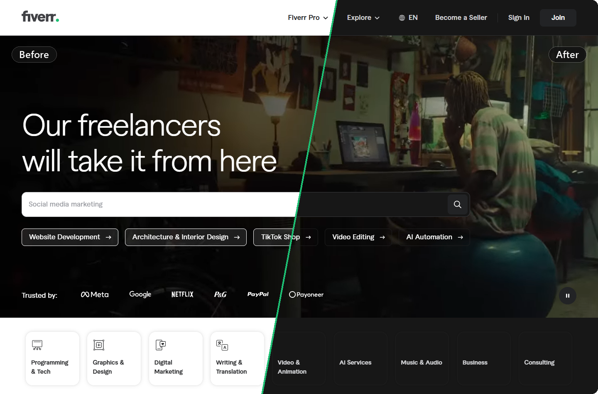
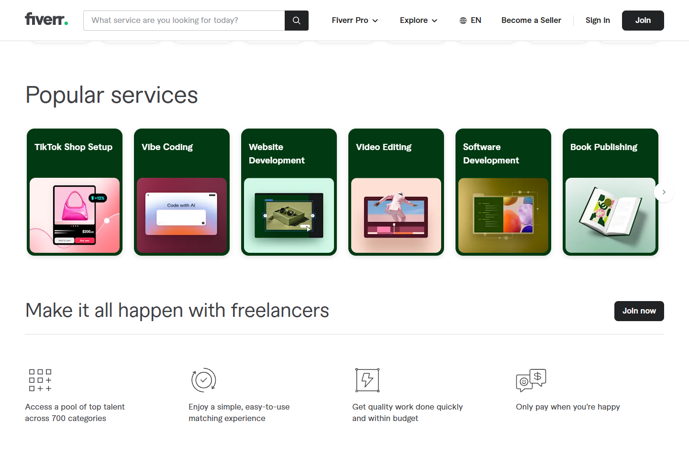
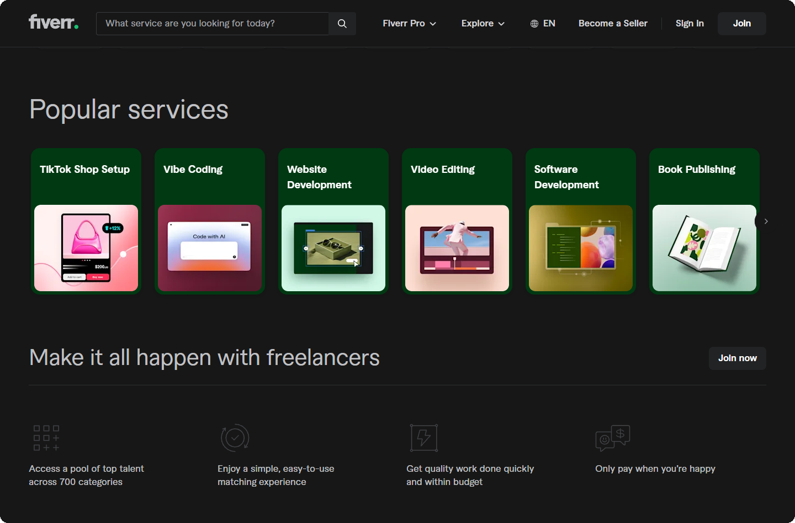
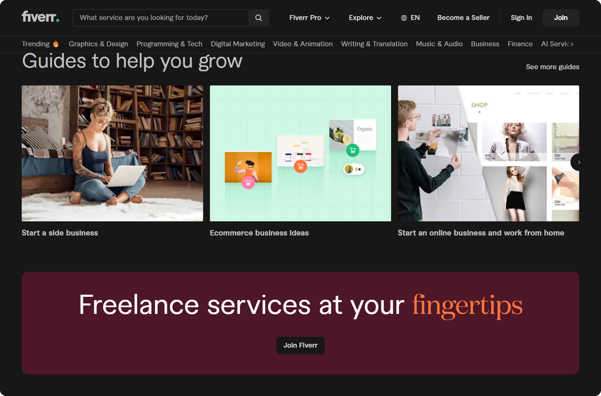
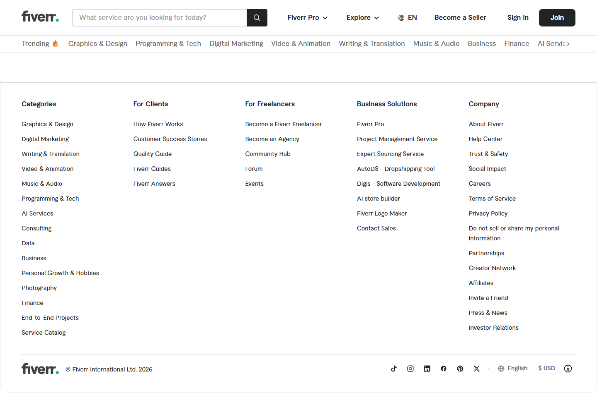
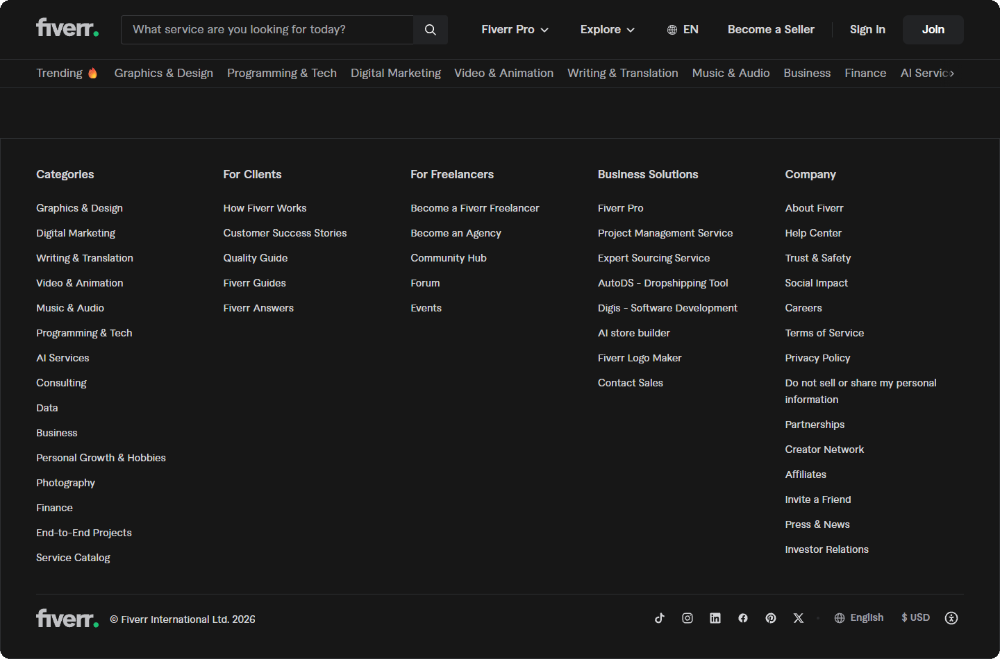
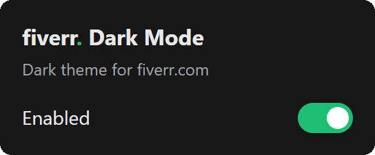

# Fiverr Dark Mode

**A clean dark theme for fiverr.com, inspired by the Fiverr mobile app.**

 

 

 

[**Download**](https://github.com/ReimaginedPixel/fiverr-dark-mode/releases/latest) ·
[Install](#install) ·
[Screenshots](#before--after) ·
[How it works](#how-it-works)

## Features

- **Whole-site dark theme.** Pages, menus, cards, forms, popups and the footer all turn dark.
- **Keeps Fiverr's look.** Brand greens, colored links and buttons stay, unless they'd be too dark to read.
- **No white flash.** Converted styles are cached, so pages are dark from the first frame.
- **Native hover and focus states.** It converts Fiverr's own stylesheets instead of repainting elements, so it doesn't slow down scrolling.
- **Images and videos are untouched.**
- **One-click toggle** from the toolbar.
- **Private.** It runs only on fiverr.com, collects nothing and has no dependencies.

## Before / After

| Before | After |
| :---: | :---: |
|  |  |
|  |  |
|  |  |

Screenshots taken logged out, in a fresh browser profile.

## Install

1. Download `fiverr-dark-mode-vX.Y.Z.zip` from the
   [latest release](https://github.com/ReimaginedPixel/fiverr-dark-mode/releases/latest) and unzip it
2. Open `chrome://extensions`
3. Turn on **Developer mode** (top right)
4. Click **Load unpacked** and select the unzipped folder
5. Open or refresh fiverr.com

It also works in other Chromium browsers (Edge, Brave, Opera, Vivaldi).

## Usage

Click the extension's toolbar button to switch the theme on or off. Open Fiverr tabs switch
right away, without a reload.

## Development

Clone the repo and load the repo folder with **Load unpacked** (same steps as above). After
changing the files, click the reload icon on the extension's card and refresh any open Fiverr
tabs. Tabs that aren't refreshed keep running the old version.

## Privacy

The extension only runs on `fiverr.com`. It doesn't collect, send or track anything. The
only data it stores is your on/off setting (`chrome.storage.sync`) and the converted
stylesheets (`chrome.storage.local`, on your own machine).

## How it works

`content.js` converts Fiverr's **stylesheets** rather than individual elements. For every
stylesheet on the page it builds a companion sheet with the same selectors and dark colors,
and inserts it right after the original, so the cascade order is unchanged. The browser then
handles hover, focus, pressed states and `::before`/`::after` on its own, and nothing runs
while you move the mouse or scroll.

- light backgrounds → dark surfaces (white becomes `#171717`)
- dark text and icons → light text
- light borders → dark grey; near-black borders (outline buttons) → light grey
- brand colors (green buttons, colored links) are kept unless they're too dark to read
- Fiverr's color variables get one dark variant per use (`--fdm-bg--x`, `--fdm-fg--x`, …),
  because the same variable can be a background in one place and text in another
- inline `style` colors and SVG `fill`/`stroke` attributes are converted as they appear

Converted sheets are cached in `chrome.storage.local`. Fiverr's CSS file names contain a
content hash, so repeat visits are dark from the first frame. On a first visit the page stays
hidden on a dark background until its stylesheets are converted (2.5 seconds at most), so
it doesn't flash white. Change `CACHE_PREFIX` in `content.js` whenever the color conversion
changes, so old cached output is dropped.

Images and videos are never changed. Stylesheets from other extensions are left alone, and so
are third-party stylesheets that can't be read.

## Known issues

- A few icons that Fiverr ships as images and blends into light cards (for example the
  category icons under the homepage hero) are hard to see or disappear on dark cards.

Found something else? [Open an issue](https://github.com/ReimaginedPixel/fiverr-dark-mode/issues).

## License

[MIT](LICENSE)

This is an unofficial project. It is not affiliated with, endorsed by or sponsored by Fiverr
International Ltd. "Fiverr" is a trademark of its respective owner.
